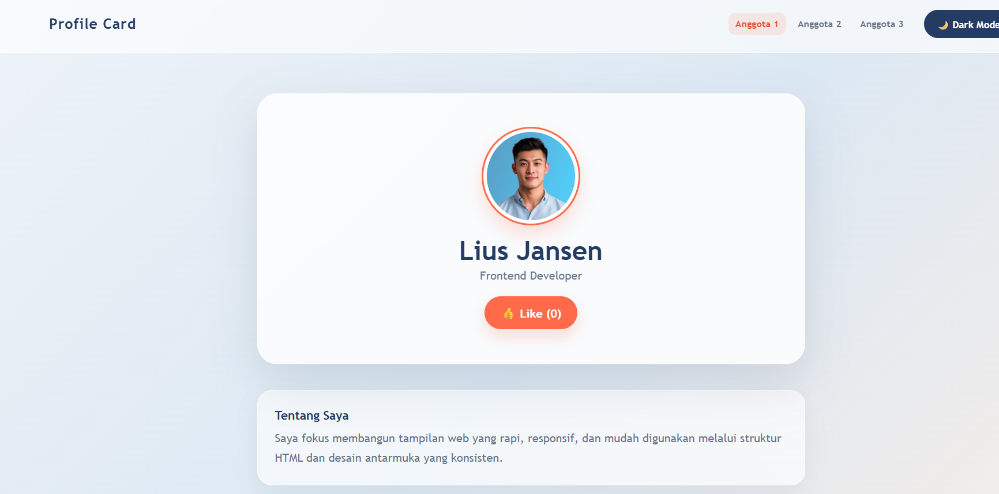

#  Study Case - Git & GitHub Workshop

Proyek web interaktif sederhana yang dibuat secara kolaboratif oleh Tim.

##  Visualisasi

##  Tech Stack
* **HTML5** - Struktur Halaman
* **CSS3** - Styling & Layoutinging
* **JavaScript** - Interaktivitas & Theme Toggle

##  Fitur Utama
* **Profile Card:** Menampilkan informasi anggota kelompok.
* **Navigation Member:** Pindah tampilan anggota secara dinamis.
* **Dark Mode Toggle:** Fitur ubah tema terang/gelap.

##  Contribution
* **Project Initiator (Hendri):** Menyiapkan struktur repositori & integrasi HTML.
* **Styling Engineer (Lius):** Membuat tata letak & desain antarmuka (`style.css`).
* **Script Engineer (Hendra):** Mengimplementasikan logika fitur JavaScript (`script.js`).

##  What I Learned
* Cara kerja Git branching (`feature/styling`, `feature/scripting`).
* Menyelesaikan masalah *Merge Conflict* di GitHub.
* Berkolaborasi menggunakan Pull Request & Code Review.

##  Feature Improvement
* Menambahkan animasi transisi saat berpindah tema.
* Mengoptimalkan tampilan responsif untuk layar HP.
